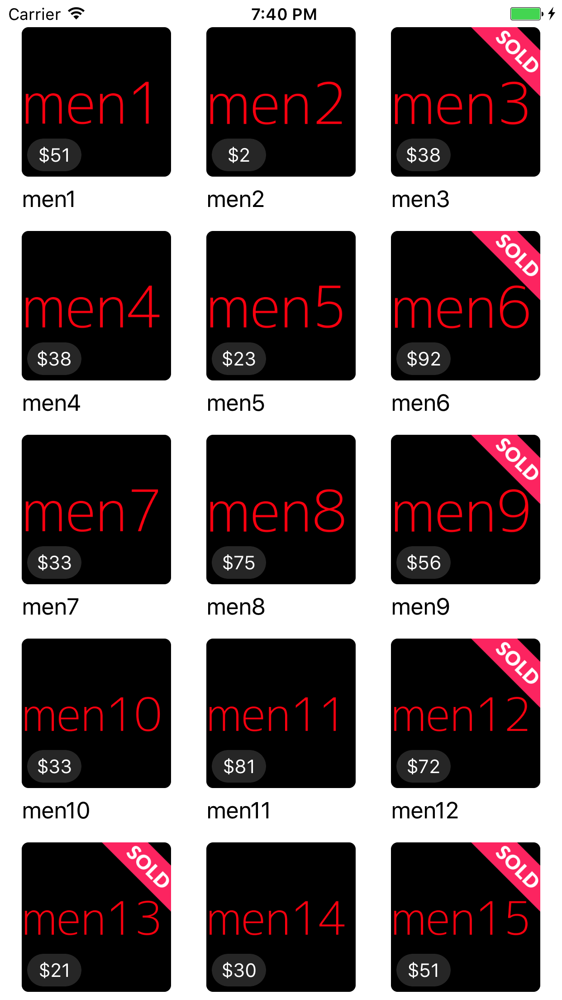

## Description

- Build an app that loads data from `all.json` which is stored in main bundle, and make the app look like the above screenshot.
- Write in a such way that data retrieval implementation can be easily replaced. For example, it is currenly loaded from all.json file but in the near future we might want to fetch the data from network.
- In the collection cell view, it needs to display item image from photo, title from name, and price from price.
- Used Swift and ReactiveSwift.
display sold.png as shown when Item.status equals to sold_out.
- Unit tests for bonus points
- Please use a known architecture with justification for your choice included

Estimated time commitment: 2 hours
